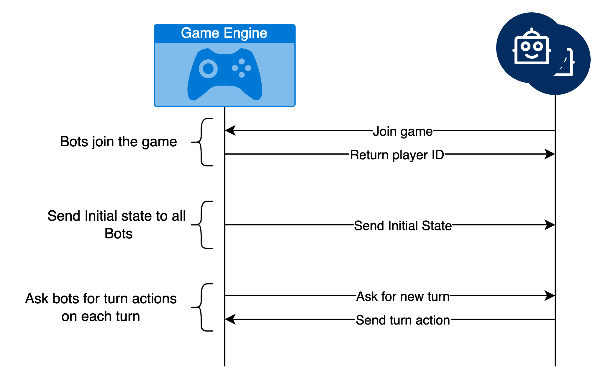

# codeconz-lighthouses-py-bot

This is a Python bot that can be used to play the game of Lighthouses on the CodeConz platform.

## Interaction flow with the Game Engine



The bot interacts with the game engine in three steps:

1. **Join Game**: The bot sends a join request to the game engine to join the game. The game engine responds with the Bot ID.
2. **Get Initial State**: The game engine sends get the initial state of the game to the bots.
3. **Turn request**: The game engine requests the bot to make an action on each turn, and sends the current state to the bot. The bot responds with the action.

For more in depth information on the game, please refer to the [Game Engine documentation](https://github.com/intelygenz/codeconz-lighthouses-engine/blob/master/README.md).

## Configuration

The needed configuration for the bot is embedded in the [entrypoint.sh](entrypoint.sh) file.
```Dockerfile
python3 ./main.py --bn=${BOT_NAME} --la=${BOT_NAME}:3001 --gs=game:50051
```

The bot is prepared so that you don't need to change anything, but if you want to, you can change the following parameters:
- **Bot port**: The port where the bot will listen for the game engine requests. Defaults to `3001`.

The next parameters are already set for you, and you don't need to change them:
- **Bot name**: Defaults to the name of the owner + the name of the repository. For the template example it will be `intelygenz-codeconz-lighthouses-go-bot`.
- **Game engine address**: The address where the game engine is listening for the bot requests. Defaults to `game:50051`.


## Run locally

To run the bot locally, you need to have Python 3.7 or higher installed on your
machine. You can install the dependencies by running the following command:

```bash
pip install -r requirements.txt
```

You are free to use any virtual environment manager like `virtualenv` or
`pipenv`.

To run the bot, you can use the following command:

```bash
make runbotpy
```

## Notes

- You can start implementing your bot in the `main.py` file.
- Do not change anything in the Dockerfile, entrypoint.sh, .github/workflows or internal folder.
- The bot will not be able to connect to the game engine if it is not running.
